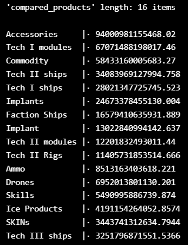
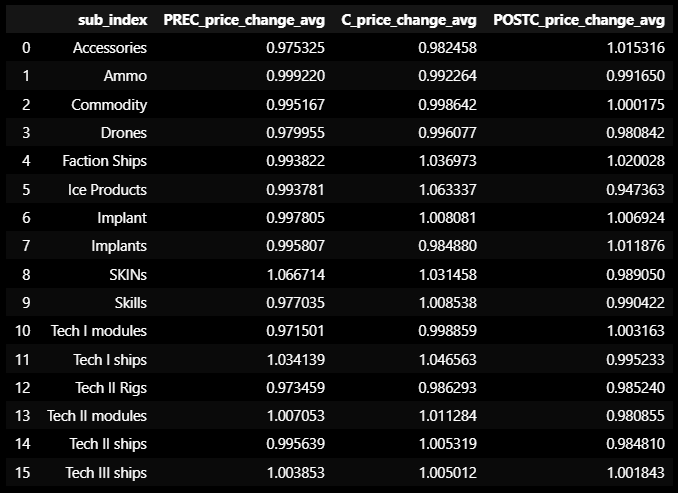

# **PROYECTO**
## *ESTADÍSTICA SOBRE EL MERCADO DE 'EVE ONLINE' EN ÉPOCA DE CONFLICTO PVP*  
----
# **HIPÓTESIS**:
> "The Massacre at M2-XFE (December 31, 2020)"  
> tuvo un impacto directo en el mercado de EVE Online.
----
# **ESTRUCTURA DEL REPOSITORIO:**
* ## ***data***:
    - Contiene el archivo .csv resultante de haber subido los datos del DataFrame a base de datos SQL en cierto punto del proyecto y haberlos extraído desde SQL a ruta local. 
* ## ***img***:
    - Contiene la carpeta '*graphs*', que a su vez contiene '*html*' y '*png*'.  
        Aquí se guardan los distintos gráficos que se han generado en la exploración y análisis de los datos.
    - Contiene '*other*'  
        Hay otros recursos capturados con motivo de presentación de proyecto.
* ## ***Monthly Economy Report***:
    - Contiene los archivos *.zip*, resultado de hacer scraping para obtener los datos necesarios para el análisis, y contiene la carpeta '*descomprimidos*' donde están los archivos descomprimidos.  
        Ya que en este proyecto sólo se utiliza un archivo en concreto, esta carpeta tan sólo va a contener el *.zip* contenedor de ese archivo y el archivo en cuestión dentro de '*descomprimidos*'.
* ## ***src***:
    - Contiene el archivo '*main.ipynb*' en el cuál se hace todo el proyecto, ya que no ha habido tiempo de modularización antes de la fecha de presentación.
---- 
# **CONTEXTO:**  
  
* ## ***EVE Online***

  ## Es un videouego **MMORPG** *'sandbox expacial'*, con 20 años de antigüedad actualmente, desarrollado por la empresa **CCP Games** (1997, Reykjavik, Islandia).  
  
* ## **CCP Games** celebra anualmente el evento ***EVE FANFEST***.

  ## Si quieres tu entrada para 2023 (REYKJAVIK 21-23 SEPT) actualmente cuesta $190.00.  
  
* ## ***THE COUNCIL OF STELLAR MANAGEMENT (CSM)***
    
  ## Es un grupo de 10 jugadores, elegidos democráticamente por la comunidad, que participa activamente en el continuo desarrollo de EVE Online teniendo comunicación directa con CCP.  
  
    > The role of a CSM member is to represent the players in the ongoing development of EVE Online by providing analysis, sharing suggestions, and giving feedback based on the ongoing community discussions and concerns to CCP. As an elected representative, a CSM member will have clear communication paths with CCP and a chance to influence the development of EVE Online many times during their term.  
  
    > The CSM will have regular online meetings with the Community Team and members of the EVE Online game development, access to selected internal sites, and a direct connection to various teams across the organization.  
  
    > The CSM will be asked to attend a one 5-day on-site summit in person in Iceland where they will:  
    > * Take part in high-intensity work sessions, playtests and brainstormings with the EVE Online teams.  
    > * Share knowledge by delivering insightful presentations on topics that can benefit the EVE Online game development.  
    > * Participate in content creation that can be used on EVE Online's channels.  
  
    > Every member of the Council will have a chance to join remotely if t-hey are unable to attend, and every member can request summit sessions on specific topics. CCP will cover the cost of flights, accommodation, transfers within Iceland, and provide a complimentary allowance for basic food expenses for those attending CSM summits."  
    ## Más información: https://community.eveonline.com/community/csm/  
  
* ## ***Alpha y Omega***

  * #### EVE Online es gratuito (F2P).  
  * #### En el juego eres un clon inmortal ya que la humanidad ha evolucionado hasta la época de singularidad tecnológica y es capaz de traspasar su consciencia a otro cuerpo.  
  * #### Si juegas gratis serás lo llamado "Clon Alpha" (α), pero puedes comprar PLEX (moneda de pago) y convertirte en lo que llaman "Clon Omega" (Ω).  
  * #### El PLEX puede ser comprado con dinero real o puede ser comprado con dinero del juego ISK.  
  * #### Esta es la premisa sobre la cual se basa todo el cálculo de pérdidas en los conflictos PvP (Player vs Player) en EVE Online, ya que se puede calcular el coste de las pérdidas equivalente en dinero real.  
  
* ## ***Volviendo a la hipótesis planteada:***
    
  ## https://www.eveonline.com/es/news/view/the-massacre-of-m2-xfe
  ## "The Massacre at M2-XFE (December 31, 2020)"  
    
  * #### Fue uno de los conflictos PvP más recientes en EVE Online.
  * #### Su precedente de similar escala fue "The Bloodbath of B-R5RB (January 27, 2014)", donde se registraron pérdidas por valor de $300,000 - $330,000.
  * #### Esta vez las pérdidas ascendieron a $378,012.  

  * #### Hay que tener en cuenta que en el primer conflicto la batalla duró 21 horas, con un pico de jugadores de 2670, mientras que este conflicto tan sólo duró 14 horas, con un pico de jugadores de 5158.  
  
  * #### Es por este motivo que me planteo si estos sucesos tienen un impacto directo en el mercado del juego.  
  

----
#
#
## Tras hacer scraping y extraer los datos hice un filtrado de archivos. Esto me llevó a seleccionar aquel que quería importar como un DataFrame de Pandas.
#
## Empecé a manipular el DataFrame hasta quedarme con un filtro de productos con mayor valor total en los años de 2018 a 2022:

<a href="https://github.com/z3r0n1/project_stats/blob/main/img/graphs/html/Evolución%20de%20cambio%20de%20precio%20de%20los%2020%20productos%20con%20mayor%20valor%20total%20durante%20el%20año%202018.html">Evolución de cambio de precio de los 20 productos con mayor valor total durante el año 2018 - Descarga el gráfico interactivo</a>
<picture>
 
</picture>

<a href="https://github.com/z3r0n1/project_stats/blob/main/img/graphs/html/Evolución%20de%20cambio%20de%20precio%20de%20los%2020%20productos%20con%20mayor%20valor%20total%20durante%20el%20año%202019.html">Evolución de cambio de precio de los 20 productos con mayor valor total durante el año 2019 - Descarga el gráfico interactivo</a>
<picture>
 
</picture>

<a href="https://github.com/z3r0n1/project_stats/blob/main/img/graphs/html/Evolución%20de%20cambio%20de%20precio%20de%20los%2020%20productos%20con%20mayor%20valor%20total%20durante%20el%20año%202020.html">Evolución de cambio de precio de los 20 productos con mayor valor total durante el año 2020 - Descarga el gráfico interactivo</a>
<picture>
 
</picture>

<a href="https://github.com/z3r0n1/project_stats/blob/main/img/graphs/html/Evolución%20de%20cambio%20de%20precio%20de%20los%2020%20productos%20con%20mayor%20valor%20total%20durante%20el%20año%202021.html">Evolución de cambio de precio de los 20 productos con mayor valor total durante el año 2021 - Descarga el gráfico interactivo</a>
<picture>
 
</picture>

<a href="https://github.com/z3r0n1/project_stats/blob/main/img/graphs/html/Evolución%20de%20cambio%20de%20precio%20de%20los%2020%20productos%20con%20mayor%20valor%20total%20durante%20el%20año%202022.html">Evolución de cambio de precio de los 20 productos con mayor valor total durante el año 2022 - Descarga el gráfico interactivo</a>
<picture>
 
</picture>

## Tras esto quise encontrar los productos comunes en todos estos años, así que agrupé los productos por cada año en listas que compararía hasta quedarme con 16 productos que parecen ser los que tienen mayor valor total en cada uno de los años.

<picture>
 
</picture>

## Después agrupé los datos en un nuevo DataFrame filtrando por esa lista de productos durante el período Pre-Conflicto, el período de Conflicto y el período Post-Conflicto.

<picture>
 
</picture>

## Seguidamente subí estos datos a SQL.

## Creé un gráfico de líneas (lineplot) donde se viera la evolución de cambio de precio de los 16 productos en los 3 períodos establecidos.

<a href="https://github.com/z3r0n1/project_stats/blob/main/img/graphs/html/Evolución%20de%20la%20media%20de%20los%20cambios%20de%20precio%20por%20época.html">Evolución de la media de los cambios de precio por época - Descarga el gráfico interactivo</a>
<picture>
 
</picture>

## También un gráfico de cajas (boxplot) donde se viera fácilmente la agrupación de los datos en cada período.

<picture>
 
</picture>

## Finalmente busqué la correlación de las medias entre los distintos períodos utilizando método Pearson y Spearman. Hice mapas de calor (heatmap) para graficarlo.

## Pre-Conflicto VS Conflicto Pearson:
<picture>
 
</picture>

## Pre-Conflicto VS Conflicto Spearman:
<picture>
 
</picture>

## Conflicto VS Post-Conflicto Pearson:
<picture>
 
</picture>

## Conflicto VS Post-Conflicto Spearman:
<picture>
 
</picture>

## Pre-Conflicto VS Post-Conflicto Pearson:
<picture>
 
</picture>

## Pre-Conflicto VS Post-Conflicto Spearman:
<picture>
 
</picture>

## Uno de los puntos que no se han podido desarrollar es la posibilidad de calcular la probabilidad de cambio de precio (alza o baja) en caso de que se de un conflicto semejante a los conocidos. Para hacerlo se requiere un modelo de regresión lineal, modelo de regresión no lineal o modelo de redes neuronales.

# Finalmente expongo la conclusión de mi Hipótesis:
## La Masacre en M2-XFE pudo haber tenido un ligero impacto directo en los precios de mercado de EvE Online, ya que puede visualizarse una ligera subida en la media de precios de los artículos con mayor valor (e impacto) en el juego, pero no puede establecerse una fuerte correlación que indique que hay una causalidad directa entre estos sucesos.
## También deberían observarse otros factores causantes de fluctuaciones de precios en el mercado para entender el porqué de este suceso.
